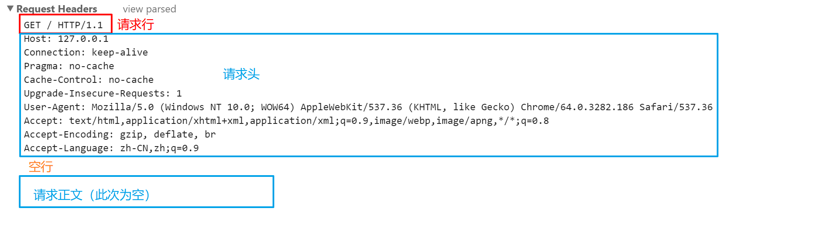
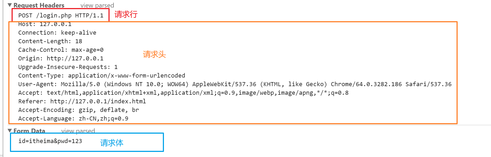

# **Ajax** - day05


## 回顾

1. 模板引擎
2. jqAjax使用

   

## demo-英雄检索


### 分析

#### 布局

 	1. 顶部
      	1. 图片
		2. 版心
      	1. 顶部是tab ul+li
      	2. table
		3. 背景
      	1. 背景图
		4. loading
      	1. 宽高100%的div
      	2. loading动画是gif

#### 需求

1. 随机背景图
2. 点击tab 高亮
3. 底部内容跟随tab切换
4. 点击头像看酷炫效果


### 随机背景图

返回随机的lol英雄皮肤

- 请求地址:https://autumnfish.cn/api/cover/random
- 请求方法：get
- 请求参数：无

```
{
    "code": 200,
    "msg": "获取成功",
    "url": "http://ossweb-img.qq.com/images/lol/web201310/skin/big90000.jpg"
}
```

步骤

1. 打开网页之后，调用随机二次元图片的接口
2. 数据获取到之后设置给body的背景图即可
3. 如果希望隔一段时间来一个新的，使用定时器即可


### 点击高亮tab

步骤

 	1. 绑定点击事件，那一排tab
		2. 为点击的添加 active  类
		3. 移除他兄弟的 active 类
		4. 默认点中第一个 调用第一个的点击事件


### 底部内容跟随tab切换

- 请求地址：<https://autumnfish.cn/api/cq/category>
- 请求方法：get
- 请求参数：type，剑士，骑士，弓手，猎人，法师，祭司 

步骤

 	1. tab的点击事件中 ajax调用接口
		2. 数据回来之后渲染到页面上


### 点击头像看酷炫效果

- 请求地址：<https://autumnfish.cn/api/cq/gif>
- 请求方法：get
- 请求参数：name

步骤

 	1. 点击英雄头像
 	2. 弹出遮罩层  有loading动画
 	3. 获取该英雄对应的gif图
 	4. 获取到之后，设置到遮罩层中的img的src上即可
 	5. 双击关闭遮罩层

重点

ajax中经常需要动态创建元素，这些元素不能直接绑定事件

可以使用事件委托把事件绑定给父元素

```js
$(父元素).on(事件名,子元素选择器,function(){})
```

### bug 第二个英雄没有loading动画

步骤

	1. 遮罩层关闭之后把gif设置回 loading动画


## demo-英雄分页


###  分析

布局

1. 顶部导航
2. 分页
3. 栅格
4. 媒体对象

需求

 	1. 查询数据
 	2. 上一页
 	3. 下一页
 	4. 每次获取数据的时候 展示loading图


### 查询数据

- 请求地址：<https://autumnfish.cn/api/cq/page>
- 请求方法：get
- 请求参数：query

步骤

 	1. 点击搜索，以及文本框的 keyup 查询数据
 	2. 调用接口
      	1. query 直接从文本框获取
      	2. pageNum  为了方便修改 设置为变量
      	3. pageSize  为了方便修改 设置为变量
      	3. 数据回来之后渲染到页面上


### 上一页

步骤

1. 点击上一页

2. 页码--

3. 如果小于1 提示

4. 重新调用接口（调用抽取的方法即可）

   

### 下一页

步骤

1. 点击下一页
2. 页码++
3. 如果大于总页数 提示
4. 重新调用接口（调用抽取的方法即可）

### 上一页和下一页注意点

1. 为了方便修改页码，把页码变为变量
2. 虽然页容量没有修改依旧不建议写死在代码中
3. 这种直接写死的操作 有个名字 `magic number`,缺点如果要改动需要深入代码才可以
4. 建议 顶部把所有用到的值声明为变量


## NetWork 面板


## HTTP协议(了解)

> 在我们刚刚学的ajax中，网页会跟服务器进行通信，在它们通信过程中，彼此需要遵守一定的协议，这套协议我们就叫HTTP协议。

###  基本概念：

**首先我们要先弄明白什么是协议？**：

```
我们生活中有多种多样的协议，诸如：用人协议、租房协议等。

用人协议：就是规范了用人应该遵守的一些行为

租房协议：规范了租房时的一些行为
```

**那么HTTP协议呢:**他也叫超文本传输协议，完整的写法是

 HyperText（超文本） Transfer（传输） Protocol（协议）

**综上HTTP协议的概念是:**

- 就是一套用来规范网页和服务器通信行为的一种协议
- 他规范了浏览器发请求时的格式
- 服务器响应请求的格式

> 例：我们之前学的ajax就好几次要跟服务器通信要数据，HTTP协议就是规范了浏览器发请求时的格式，服务器响应请求的格式

> 画图解释浏览器请求服务器，服务器响应浏览器过程

### 4.4 请求报文

- 通过浏览器开发者工具，演示
- 
- 请求报文
- 请求报文：就是浏览器按照HTTP协议规定的格式来发请求的内容
- 请求报文三大部分：`请求行` 、 `请求头`  、`请求体`



**`请求行`**：指明本次请求是`get`请求还是`post`请求（也有其他请求，例如put、delete、trace等，但不常用，常用的主要为get和post），以及指明本次请求遵守的协议版本，请求路径

**`请求头`**：本部分的格式以`键值对`的形式组成，每行一对。本部分大概的内容有：服务器域名、连接状态、缓存状态、发起请求的浏览器信息、字符编码等。请求头后面会有一个空行，作为请求头部分结束的标记。

**`请求体`**：本次请求发送给服务器的数据。一般`get请求`的请求正文为空

> 在get请求中，一般没有请求体，post才有


- 下图为post请求报文




**结论**：

- 无论是`get`还是`post`发起的请求，格式都是三大部分，`请求行`、`请求头`、`请求体`。
- 总结： 请求报文里主要包含了要访问的文件、和在请求时传递给服务器的数据、发请求的系统环境等。


**GET与POST的区别和各自使用**

- 相同点
  - 都能给服务器发请求并给服务器传递数据
- 不同点
  - GET传递数据通过URL，数据都暴露在网址上，POST传递数据通过请求体传递
- 以后发请求选什么请求？
  - 没有特别规定。但是一般侧重于查询数据、获取数据用GET，侧重于修改数据用POST


附：请求头部分内容说明

| **请求头**          | **说明**                                            |
| ------------------- | --------------------------------------------------- |
| **Host**            | 接受请求的服务器地址，可以是IP:端口号，也可以是域名 |
| **User-Agent**      | 发送请求的应用程序名称                              |
| **Connection**      | 指定与连接相关的属性，如Connection:Keep-Alive       |
| **Accept-Charset**  | 通知服务端可以发送的编码格式                        |
| **Accept-Encoding** | 通知服务端可以发送的数据压缩格式                    |
| **Accept-Language** | 通知服务端可以发送的语言                            |


### 4.5 响应报文

- 服务器收到请求后，要给浏览器一个"回答"，这个"回答"按照HTTP协议约定的格式来把数据传递给浏览器
- 演示如何通过浏览器开发者工具看到响应报文
- 响应报文三大部分：响应行、响应头、响应体

如图（仅包含响应行和响应头）：


响应体如下：


**响应行**

- 三部分组成：协议版本、 响应状态码、 响应消息
  - 指明遵守的http协议版本
  - 响应状态码是告诉浏览器这次响应状态
  - 响应消息是对状态码的说明：例如这次状态码为200，响应消息OK，相当于告诉你，状态码为200，代表这次响应正常
  - 状态码一览

**响应头 **

- 服务器返回给浏览器的一些额外信息，说明服务器的一些环境信息等

| **响应头**       | **说明**                                                     |
| ---------------- | ------------------------------------------------------------ |
| **Date**         | 当前时间                                                     |
| **Server**       | 服务器名字、使用的web服务等                                  |
| **Connection**   | 指定与连接相关的属性，如Connection:Keep-Alive                |
| **Content-Type** | 告诉浏览器，响应体是什么类型的文件，常见如：Content-Type:text/html |

**响应体**

- 就是服务器返回给浏览器的数据

  - 浏览器请求服务器，主要是为了从服务器得到数据
  - 服务器返回给浏览器的，就是通过响应体返回

  

**Content-type**

- Content-type就是告诉浏览器应该按什么样的文件格式来解析响应体
- 例：
  - Content-Type:text/html; 代表用html来解析响应体
  - Content-Type:image/jpeg; 代表用图片来解析响应体
  - Content-Type:text/css; 代表用样式表来解析响应体
  - 看课堂演示


### 4.6 完整请求响应图解


## http协议

http协议 规范了浏览器跟服务器交互的数据格式

1. 请求报文

   1. 请求行:请求方法和请求地址
   2. 请求头:告诉服务器的一些信息
   3. 请求主体:提交到服务器的数据
   4. ajax的本质就是通过XMLHTTPRequet对象 向服务器发送请求报文

   

2. 响应报文

   1. 状态行:这次请求的状态（成功与否）
   2. 响应头:服务器传递过来的额外信息，比如数据格式，语言环境，服务器信息.
   3. 响应主体:需要的数据
   4. 响应报文是服务器返回给浏览器的数据格式，是必须遵守的一个格式

   

   5. jQuery自动转化JSON的本质，是根据响应报文的响应头中的content-type 如果是json就回自动转，如果不是需要人为的设置dataType:为json


### 总结

1. http协议规定了浏览器跟服务器交互的数据格式
2. 浏览器发的必须是 请求报文
3. 服务器返回的必须是 响应报文
4. 他们的组成部分分别是
   1. 请求报文
      1. 请求行
      2. 请求头
      3. 请求主体：浏览器 发给服务器的数据
   2. 响应报文
      1. 状态行
      2. 响应头:content-type 返回的数据格式，jQuery自动转JSON就是根据他来判断的
      3. 响应主体:找服务器要的数据
5. ajax的本质就是 利用XMLHttpRequest对象 设置请求行，请求头，请求主体 进而发送请求报文